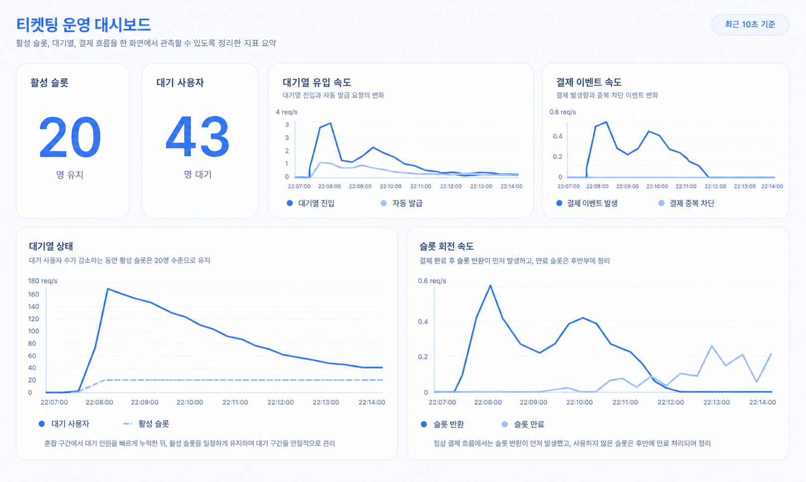

# Ticketing Server

Redis 대기열, Kafka 결제 이벤트, PostgreSQL 재고 트랜잭션을 조합해 티켓 오픈 시점의 동시 요청을 제어하는 Spring Boot 기반 예매 서버입니다.



## 1. 프로젝트 개요

이 프로젝트는 한정된 티켓 재고에 짧은 시간 동안 요청이 몰릴 때 발생하는 동시성 충돌, 결제 처리 지연, 대기열 정체 문제를 해결하기 위해 개발한 티켓 예매 시스템입니다.

일반적인 동기식 API 흐름에서는 모든 사용자가 동시에 결제 API와 재고 테이블에 접근할 수 있고, 결제 처리 지연이나 재시도가 API 응답 지연과 재고 불일치로 이어질 수 있습니다.

이를 해결하기 위해 Redis 기반 대기열과 20개 활성 슬롯으로 결제 진입량을 제한하고, Kafka로 결제 요청 저장과 재고 차감을 비동기 처리하도록 분리했습니다. 최종 재고 변경은 PostgreSQL 트랜잭션 안에서 처리하고, Redis 슬롯 반환은 DB 커밋 이후에 수행해 상태 불일치 가능성을 줄였습니다.

## 2. 문제 정의

### 문제 1. 동시 결제 요청이 재고 테이블에 집중됨

티켓 오픈 직후 모든 사용자가 바로 결제 단계로 진입하면 같은 이벤트의 재고 row에 요청이 몰립니다. 재고 확인과 차감이 원자적으로 묶이지 않으면 초과 판매 위험이 생기고, 원자성을 보장하더라도 DB lock wait이 API 응답 지연으로 전파될 수 있습니다.

### 문제 2. 결제 요청 처리가 API 응답 경로에 묶임

결제 요청 저장, 중복 확인, 재고 차감, 후속 슬롯 반환을 하나의 HTTP 요청 안에서 모두 처리하면 일부 단계의 지연이 전체 요청 지연으로 이어집니다. 장애 상황에서도 재시도와 중복 요청을 흡수할 경계가 약해집니다.

### 문제 3. 입장 토큰 만료 후 슬롯이 반환되지 않을 수 있음

입장 토큰은 TTL로 만료되지만, 별도 자료구조로 관리하는 활성 슬롯에서 사용자를 제거하지 않으면 다음 대기자가 입장하지 못합니다. 이 경우 대기열은 남아 있는데 결제 가능 슬롯은 비어 있지 않은 상태처럼 보입니다.

### 왜 문제인가

- 실제 서비스 영향: 결제 가능 인원이 통제되지 않으면 품절 시점에 중복 결제, 재고 음수화, 긴 대기 시간이 발생할 수 있습니다.
- 운영 리스크: API 지연, Kafka 소비 실패, Redis 슬롯 정체를 관측하지 못하면 장애 원인을 사용자 요청 단위에서 추적하기 어렵습니다.

## 3. 해결 방식

### 전체 구조

```text
Client
  -> Spring Security / JWT
  -> REST Controller
  -> Application Service
  -> Redis queue / active slots
  -> Kafka topic: payment-requests
  -> Kafka Consumer
  -> PostgreSQL transaction
  -> Prometheus / Grafana
```

### 핵심 설계 1. Redis 대기열과 활성 슬롯

대기자는 `queue:{eventId}` Redis ZSET에 진입 순서 score로 저장합니다. 결제 단계에 들어갈 수 있는 사용자는 `active_slots:{eventId}` ZSET에 별도로 보관하고, 기본값 기준 최대 20명만 활성화합니다.

대기열에서 사용자를 꺼내고, 입장 토큰을 발급하고, 활성 슬롯에 추가하는 작업은 Lua script로 한 번에 처리합니다. 여러 요청이 동시에 들어와도 `max-active-slots`를 넘지 않도록 Redis 안에서 원자적으로 처리하기 위한 선택입니다.

근거:
- [`QueueService`](src/main/java/com/example/ticketing/application/queue/QueueService.java)
- [`application.yml`](src/main/resources/application.yml)

### 핵심 설계 2. Kafka 기반 결제 요청 분리

결제 API는 입장 토큰과 중복 요청 guard를 확인한 뒤 Kafka `payment-requests` 토픽에 이벤트를 발행하고 `PUBLISHED` 상태를 반환합니다. 실제 결제 요청 저장과 재고 차감은 consumer가 처리합니다.

이 구조는 결제 요청 접수와 재고 변경을 분리해 API 계층의 응답 경로를 짧게 유지하기 위한 선택입니다. 대신 Kafka는 at-least-once 소비 가능성을 가지므로, consumer에서는 `idempotency_key` unique 제약과 `ON CONFLICT DO NOTHING`으로 중복 소비를 방어합니다.

근거:
- [`PaymentApplicationService`](src/main/java/com/example/ticketing/application/payment/PaymentApplicationService.java)
- [`PaymentRequestKafkaConsumer`](src/main/java/com/example/ticketing/infra/kafka/PaymentRequestKafkaConsumer.java)
- [`PaymentRequestRepository`](src/main/java/com/example/ticketing/domain/repository/PaymentRequestRepository.java)

### 핵심 설계 3. 커밋 이후 슬롯 반환

결제 이벤트를 소비하면 DB 트랜잭션 안에서 결제 요청을 저장하고 재고를 차감합니다. 슬롯 반환은 `TransactionSynchronization.afterCommit()`에서 수행합니다.

이유는 DB 트랜잭션이 롤백됐는데 Redis 슬롯만 먼저 반환되는 상태를 피하기 위해서입니다. 예를 들어 품절로 재고 차감이 실패하면 결제 요청 insert도 롤백되어야 하고, 슬롯 반환도 성공 커밋 이후에만 일어나야 합니다.

근거:
- [`PaymentRequestService`](src/main/java/com/example/ticketing/application/payment/PaymentRequestService.java)
- [`PaymentRequestServiceRollbackTest`](src/test/java/com/example/ticketing/payment/PaymentRequestServiceRollbackTest.java)

### 핵심 설계 4. 관측 가능한 대기열

대기열 진입, 자동 발급, 수동 발급, 슬롯 반환, 슬롯 만료, 결제 발행, 중복 결제 요청을 Micrometer metric으로 기록합니다. Prometheus가 `/actuator/prometheus`를 scrape하고 Grafana 대시보드에서 활성 슬롯과 대기자 수를 확인합니다.

근거:
- [`QueueMetrics`](src/main/java/com/example/ticketing/application/queue/QueueMetrics.java)
- [`monitoring/grafana/dashboards/ticketing-overview.json`](monitoring/grafana/dashboards/ticketing-overview.json)

## 4. 설계 판단

### 동시성 제어

#### 고려한 방법

- Redis 분산 락
- DB optimistic lock
- DB pessimistic lock
- DB 조건부 업데이트

#### 선택

- Redis Lua script로 대기열과 활성 슬롯 이동을 원자 처리
- PostgreSQL pessimistic write lock으로 재고 차감 직렬화

#### 이유

- 대기열 이동은 Redis 자료구조 여러 개를 함께 변경하므로 애플리케이션에서 여러 명령을 순차 실행하면 슬롯 초과 발급 가능성이 있습니다.
- 재고는 이벤트별 단일 row 변경 작업이므로 DB 트랜잭션 안에서 lock을 잡으면 초과 판매를 명확하게 막을 수 있습니다.
- DB 트랜잭션 롤백 시 결제 요청 insert와 재고 차감을 함께 되돌릴 수 있습니다.

#### 트레이드오프

- DB pessimistic lock은 재고 row 경합이 커지면 lock wait이 발생할 수 있습니다.
- 이 프로젝트에서는 Redis 활성 슬롯을 20명으로 제한해 DB까지 도달하는 동시 결제 수를 먼저 줄였습니다.
- 추후에는 `available_quantity > 0` 조건부 업데이트 방식과 lock 기반 방식을 같은 JMeter 시나리오로 비교할 수 있습니다.

### 결제 처리 방식

#### 고려한 방법

- HTTP 요청 안에서 결제 요청 저장과 재고 차감까지 동기 처리
- Kafka로 결제 요청을 발행하고 consumer에서 저장 및 재고 차감

#### 선택

- Kafka 비동기 처리

#### 이유

- API는 입장 토큰 검증과 이벤트 발행까지만 담당해 요청 접수 경로를 짧게 유지합니다.
- consumer 재시도와 DLT 구성을 통해 처리 실패를 API 계층과 분리할 수 있습니다.
- Kafka 중복 소비 가능성은 DB unique key와 idempotent insert로 방어합니다.

#### 트레이드오프

- 클라이언트는 결제 요청 접수와 최종 저장 사이의 eventual consistency를 감안해야 합니다.
- consumer 실패, DLT 적재, 재처리 정책을 운영 지표와 함께 관리해야 합니다.

### 입장 토큰 만료 처리

#### 고려한 방법

- Redis key TTL에만 의존
- 스케줄러가 활성 슬롯 ZSET에서 만료 score를 정리

#### 선택

- 30초 주기 스케줄러로 만료된 활성 슬롯을 정리하고 다음 대기자를 자동 발급

#### 이유

- 토큰 key 만료와 `active_slots:{eventId}` ZSET 정리는 별개의 작업입니다.
- 슬롯 정리가 지연되면 대기열이 멈춘 것처럼 보이므로 주기적으로 만료 슬롯을 제거하고 `fillAvailableSlots()`를 호출합니다.

근거:
- [`QueueSlotScheduler`](src/main/java/com/example/ticketing/application/queue/QueueSlotScheduler.java)

## 5. 결과

### JMeter mixed-flow 검증

저장소에 남아 있는 `perf/jmeter/report-queue-slot-mixed/statistics.json` 기준 결과입니다.

| 항목 | 결과 |
| --- | --- |
| 시나리오 | 200 users mixed-flow |
| 흐름 | 로그인 -> 대기열 진입 -> 토큰 polling -> 70% 결제 요청 / 30% 만료 대기 |
| 전체 samples | 25,132 |
| 전체 error rate | 0.00% |
| 전체 평균 응답 시간 | 8.79ms |
| 전체 p90 / p95 / p99 | 12ms / 14ms / 18ms |
| 전체 throughput | 59.73 requests/sec |
| 결제 요청 samples | 106 |
| 결제 요청 평균 응답 시간 | 13.24ms |
| 결제 요청 p95 / p99 | 22.30ms / 122.37ms |

비교군을 같은 조건으로 측정한 기록은 저장소에 없으므로, 이 README에서는 "처리 시간이 X에서 Y로 개선됐다"는 형태의 성능 개선 주장은 하지 않습니다. 현재 확인 가능한 결과는 200명 혼합 시나리오에서 에러율 0%로 대기열, 토큰 발급, 결제 요청 접수 흐름이 완료됐다는 점입니다.

근거:
- [`queue-slot-mixed-flow.jmx`](perf/jmeter/queue-slot-mixed-flow.jmx)
- [`statistics.json`](perf/jmeter/report-queue-slot-mixed/statistics.json)
- [`jmeter.log`](jmeter.log)

### 테스트 검증

- 중복 대기열 진입 시 position이 유지되는지 검증했습니다.
- 같은 Kafka 이벤트가 두 번 소비되어도 결제 요청 row는 한 번만 생성되고 재고도 한 번만 차감되는지 검증했습니다.
- 품절 상황에서 결제 요청 insert가 함께 롤백되는지 Testcontainers 기반 PostgreSQL 테스트로 검증했습니다.

근거:
- [`QueueServiceTest`](src/test/java/com/example/ticketing/queue/QueueServiceTest.java)
- [`PaymentRequestKafkaConsumerIdempotencyTest`](src/test/java/com/example/ticketing/payment/PaymentRequestKafkaConsumerIdempotencyTest.java)
- [`PaymentRequestServiceRollbackTest`](src/test/java/com/example/ticketing/payment/PaymentRequestServiceRollbackTest.java)

## 6. 트러블슈팅

### 문제. Kafka 이벤트는 발행되지만 consumer 처리 결과가 보이지 않음

#### 현상

결제 API는 `PUBLISHED`를 반환하지만 `payment_requests` row가 생성되지 않고 재고가 줄지 않습니다.

#### 원인

producer 발행 성공과 consumer 처리 성공은 다른 단계입니다. listener container 기동, topic 구독, JSON 역직렬화, manual ack, retry/DLT 설정 중 하나가 어긋나면 발행 이후 처리가 멈출 수 있습니다.

#### 해결

`payment.consume.received` 로그와 `payment-requests` topic consumer group 상태를 확인합니다. consumer는 실패 시 `DefaultErrorHandler`가 1초 간격 3회 재시도 후 `payment-requests.DLT`로 보내도록 구성했습니다.

#### 결과

운영 확인 기준을 API 응답이 아니라 `ticketing_payment_publish_total`, consumer 로그, `payment_requests` row 생성, 재고 차감 여부로 분리했습니다.

### 문제. 입장 토큰은 만료됐는데 다음 대기자가 입장하지 않음

#### 현상

사용자 토큰 TTL이 끝났는데 활성 슬롯 수가 줄지 않아 대기열이 진행되지 않습니다.

#### 원인

`entry_token:{eventId}:{userId}` key는 TTL로 삭제되지만, `active_slots:{eventId}` ZSET의 member는 별도 정리가 필요합니다.

#### 해결

`QueueSlotScheduler`가 30초마다 만료 score를 가진 활성 슬롯을 제거하고, 빈 슬롯만큼 다음 대기자에게 토큰을 자동 발급합니다.

#### 결과

`ticketing_queue_slot_expire_total`, `ticketing_queue_active_slots`, `ticketing_queue_waiting_users`로 만료 정리와 대기열 진행 여부를 확인할 수 있습니다.

### 문제. 재고 차감 실패와 Redis 슬롯 반환 순서가 어긋날 수 있음

#### 현상

품절 또는 DB 오류로 트랜잭션이 실패했는데 Redis 슬롯이 먼저 반환되면, 실제 결제는 실패했지만 다음 사용자가 입장하는 상태가 생길 수 있습니다.

#### 원인

DB 상태 변경과 Redis 상태 변경은 하나의 트랜잭션으로 묶이지 않습니다.

#### 해결

결제 요청 저장과 재고 차감이 DB에서 커밋된 뒤 `afterCommit()`에서 슬롯을 반환하도록 처리했습니다.

#### 결과

`PaymentRequestServiceRollbackTest`에서 품절 예외 발생 시 결제 요청 row가 남지 않는 것을 확인했습니다.

## 7. 기술 스택

| 영역 | 기술 | 역할 | 선택 이유 |
| --- | --- | --- | --- |
| Backend | Java 21, Spring Boot 4 | REST API 서버 | 인증, 트랜잭션, 스케줄링, actuator 구성을 한 애플리케이션에서 일관되게 관리 |
| Security | Spring Security, JWT | 인증과 인가 | stateless API로 구성하고 관리자 API를 role 기반으로 제한 |
| Database | PostgreSQL, Spring Data JPA, Flyway | 이벤트, 유저, 재고, 결제 요청 저장 | 재고 차감과 중복 결제 방어를 DB 트랜잭션과 unique 제약으로 보장 |
| Queue | Redis ZSET, Lua script | 대기열, 입장 토큰, 활성 슬롯 관리 | 순위 조회와 슬롯 발급을 빠르게 처리하고 복수 Redis 명령을 원자화 |
| Messaging | Kafka, Spring Kafka | 결제 요청 비동기 처리 | API 요청 접수와 재고 변경을 분리하고 consumer 재시도 경계를 확보 |
| Observability | Actuator, Micrometer, Prometheus, Grafana | 메트릭 수집과 대시보드 | 대기열 정체, 슬롯 반환, 결제 발행, 중복 요청을 운영 지표로 확인 |
| Test | JUnit 5, Mockito, Testcontainers, JMeter | 단위, 통합, 부하 검증 | 중복 처리와 롤백은 자동화 테스트로, mixed-flow는 부하 테스트로 검증 |
| Infra | Docker Compose | 로컬 실행 환경 | PostgreSQL, Redis, Kafka, Prometheus, Grafana를 같은 명령으로 재현 |

## 8. 실행 방법

### 사전 준비

- Java 21
- Docker 또는 Docker Compose
- JMeter 5.6.x 이상

### 로컬 인프라 실행

```bash
cd /Users/hyosik981010/Desktop/study/ticket
docker compose up -d
```

### 애플리케이션 실행

```bash
./gradlew bootRun --args='--app.seed.enabled=true'
```

JMeter mixed-flow를 재현하려면 테스트용 토큰 조회 API가 필요하므로 `test` profile로 실행합니다.

```bash
./gradlew bootRun --args='--spring.profiles.active=test --app.seed.enabled=true'
```

seed 실행 시 생성되는 기본 계정:

| 역할 | 이메일 | 비밀번호 |
| --- | --- | --- |
| ADMIN | `admin@example.com` | `password123` |
| USER | `loaduser001@example.com`부터 `loaduser200@example.com` | `password123` |

### 확인 URL

- App: [http://localhost:8080](http://localhost:8080)
- Prometheus: [http://localhost:9090](http://localhost:9090)
- Grafana: [http://localhost:3000](http://localhost:3000), 기본 계정 `admin / admin`
- OpenAPI: [`docs/api/openapi.yaml`](docs/api/openapi.yaml)

### 테스트 실행

통합 테스트는 Testcontainers로 PostgreSQL 컨테이너를 실행하므로 Docker daemon이 실행 중이어야 합니다.

```bash
./gradlew test
```

### JMeter 실행

애플리케이션을 `test` profile로 실행한 상태에서 수행합니다.

```bash
jmeter -n -t perf/jmeter/queue-slot-mixed-flow.jmx -l /tmp/queue-slot-mixed-flow.jtl -Jusers=200 -JrampUp=20
```

HTML 리포트를 생성하려면 출력 디렉터리가 비어 있어야 합니다.

```bash
jmeter -g /tmp/queue-slot-mixed-flow.jtl -o /tmp/queue-slot-mixed-report
```

## 9. 프로젝트 구조

```text
src/main/java/com/example/ticketing
├── api
│   ├── auth
│   ├── event
│   ├── payment
│   ├── queue
│   └── dto
├── application
│   ├── auth
│   ├── event
│   ├── inventory
│   ├── payment
│   └── queue
├── config
├── domain
│   ├── entity
│   └── repository
├── infra
│   └── kafka
└── security

src/main/resources
├── application.yml
├── application-test.yml
├── db/migration
└── static

docs
├── api
├── architecture.md
├── erd.md
└── troubleshooting.md

perf/jmeter
├── queue-slot-mixed-flow.jmx
├── ticketing-flow.jmx
├── users.csv
├── admin.csv
└── report-queue-slot-mixed

monitoring
├── prometheus.yml
└── grafana
```

## 10. 개선 방향

- 재고 차감 방식을 `SELECT FOR UPDATE`와 `UPDATE ... WHERE available_quantity > 0` 조건부 업데이트로 나누어 같은 JMeter 시나리오에서 latency와 lock wait을 비교합니다.
- Kafka DLT에 쌓인 메시지를 운영자가 재처리할 수 있는 관리 API 또는 runbook을 추가합니다.
- `QueueMetrics`의 Redis `KEYS` 패턴 조회를 운영 환경에 맞게 scan 기반 또는 이벤트별 registry 방식으로 개선합니다.
- 대기열 metric을 eventId 단위로 분리해 특정 공연의 슬롯 정체와 전체 시스템 지표를 구분합니다.
- 현재 JMeter 결과는 단일 로컬 환경 기준이므로, CI 또는 별도 부하 테스트 환경에서 반복 가능한 baseline을 남깁니다.
