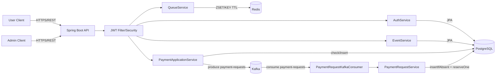

# Architecture

근거:
- `src/main/java/com/example/ticketing/api`
- `src/main/java/com/example/ticketing/application`
- `src/main/java/com/example/ticketing/infra/kafka`
- `src/main/java/com/example/ticketing/config`
- `src/main/resources/application.yml`
- `docker-compose.yml`

## 핵심 요청 흐름

1. 사용자가 `/api/auth/login`으로 JWT를 발급받습니다.
2. 사용자는 `/api/queue/{eventId}/enter`로 대기열에 진입합니다.
3. 관리자는 `/api/queue/{eventId}/issue`로 상위 N명에게 입장 토큰을 발급합니다.
4. 사용자는 발급된 토큰으로 `/api/payments/request`를 호출합니다.
5. API는 토큰/중복 여부를 검증한 뒤 Kafka `payment-requests` 토픽으로 이벤트를 발행하고 `202`를 즉시 반환합니다.
6. Kafka Consumer가 이벤트를 읽어 `payment_requests`를 저장하고 재고를 차감합니다.
7. 소비 중 실패하면 재시도 후 DLT(`payment-requests.DLT`)로 전송됩니다.

## 설계 포인트

- 인증/인가: JWT stateless + 엔드포인트별 권한 분리(`ADMIN` 전용 발급 API).
- 대기열 일관성: Redis Lua 스크립트로 토큰 발급과 큐 제거를 원자적으로 처리.
- 중복 방지: Redis 결제 가드 + DB idempotency unique key + `ON CONFLICT DO NOTHING`.
- 재고 동시성: 비관적 락(`PESSIMISTIC_WRITE`)으로 재고 감소 경합 제어.
- 비동기 내구성: Kafka 수동 ack + 재시도 + DLT 구성.

## 운영 포인트

- 로깅 키: `idempotencyKey`, `eventId`, `userId`를 produce/consume 로그에 기록.
- 장애 분석: DLT 토픽(`payment-requests.DLT`)을 주기적으로 모니터링.
- 지표 수집: 큐 길이(`queue:{eventId}` ZSET), 토큰 발급 수, 결제 요청 적재 성공률을 추적.
