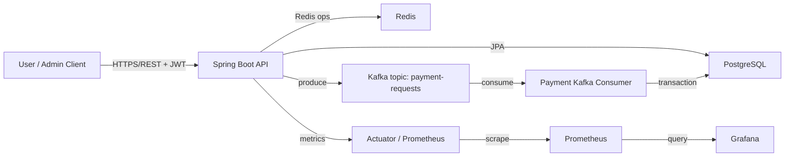

# Architecture

## 핵심 요청 흐름

1. 사용자 또는 관리자는 로그인으로 JWT를 발급받습니다.
2. 클라이언트는 이벤트를 조회하고 `POST /api/queue/{eventId}/enter`로 대기열에 진입합니다.
3. `QueueService`는 Redis ZSET 대기열과 `active_slots:{eventId}`를 기준으로 빈 슬롯을 확인합니다.
4. 빈 슬롯이 있으면 기본 프로파일에서는 10분, `test` 프로파일에서는 2분짜리 입장 토큰을 발급하고 사용자를 활성 슬롯에 등록합니다.
5. 클라이언트는 `POST /api/payments/request`로 결제 요청을 발행합니다.
6. API 서버는 요청을 바로 완료하지 않고 Kafka `payment-requests` 토픽으로 이벤트를 발행합니다.
7. `PaymentRequestKafkaConsumer`가 이벤트를 소비해 `payment_requests`를 저장하고 `ticket_inventory.available_quantity`를 감소시킵니다.
8. DB 커밋 후 슬롯을 반환하고 다음 대기자를 자동 진입시킵니다.

## 설계 포인트

- 대기열과 활성 슬롯은 Redis에서 관리해 빠른 입장 제어를 수행합니다.
- 결제 요청 저장과 재고 차감은 Kafka consumer의 트랜잭션 안에서 처리합니다.
- `afterCommit` 후 슬롯을 반환해 DB 롤백과 Redis 상태 불일치를 줄입니다.
- 관리자 수동 발급 API를 유지하되, 자동 발급과 동일한 Redis 원자 로직을 사용합니다.
- 테스트 프로파일에서는 토큰 TTL을 2분으로 줄여 JMeter mixed-flow 검증을 빠르게 수행합니다.

## 운영 포인트

- `/actuator/prometheus`로 Micrometer 메트릭을 노출합니다.
- Grafana 대시보드에서 활성 슬롯, 대기 사용자, 발급/반환/만료율을 관찰합니다.
- JMeter 200-user mixed-flow 시나리오는 `test` 프로파일의 2분 TTL을 기준으로 결제 성공과 토큰 만료를 함께 재현합니다.

근거:
- `src/main/java/com/example/ticketing/application/queue/QueueService.java`
- `src/main/java/com/example/ticketing/application/payment/PaymentRequestService.java`
- `src/main/java/com/example/ticketing/infra/kafka/PaymentRequestKafkaConsumer.java`
- `monitoring/grafana/dashboards/ticketing-overview.json`
