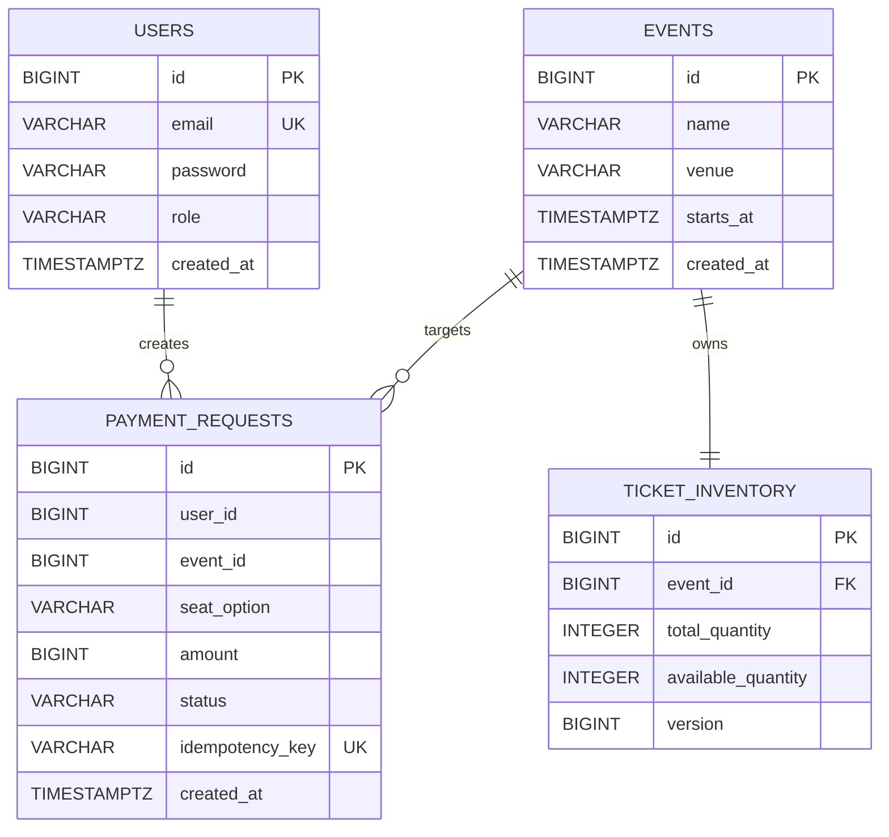

# ERD

## 테이블별 역할

- `users`: 로그인 계정과 권한(`USER`, `ADMIN`)을 저장합니다.
- `events`: 판매 대상 이벤트 기본 정보를 저장합니다.
- `ticket_inventory`: 이벤트 단위 재고를 관리합니다.
- `payment_requests`: Kafka consumer가 기록하는 결제 요청 이력입니다.

## 운영 포인트

- `payment_requests.idempotency_key`는 유니크 제약으로 중복 소비를 막습니다.
- `payment_requests(user_id, event_id, seat_option)` 인덱스가 사용자별 요청 조회를 보조합니다.
- `ticket_inventory.version`과 `findByEventIdForUpdate()`가 재고 차감 동시성 제어에 사용됩니다.

근거:
- `src/main/resources/db/migration/V1__init_schema.sql`
- `src/main/java/com/example/ticketing/domain/entity/TicketInventory.java`
- `src/main/java/com/example/ticketing/domain/entity/PaymentRequest.java`
