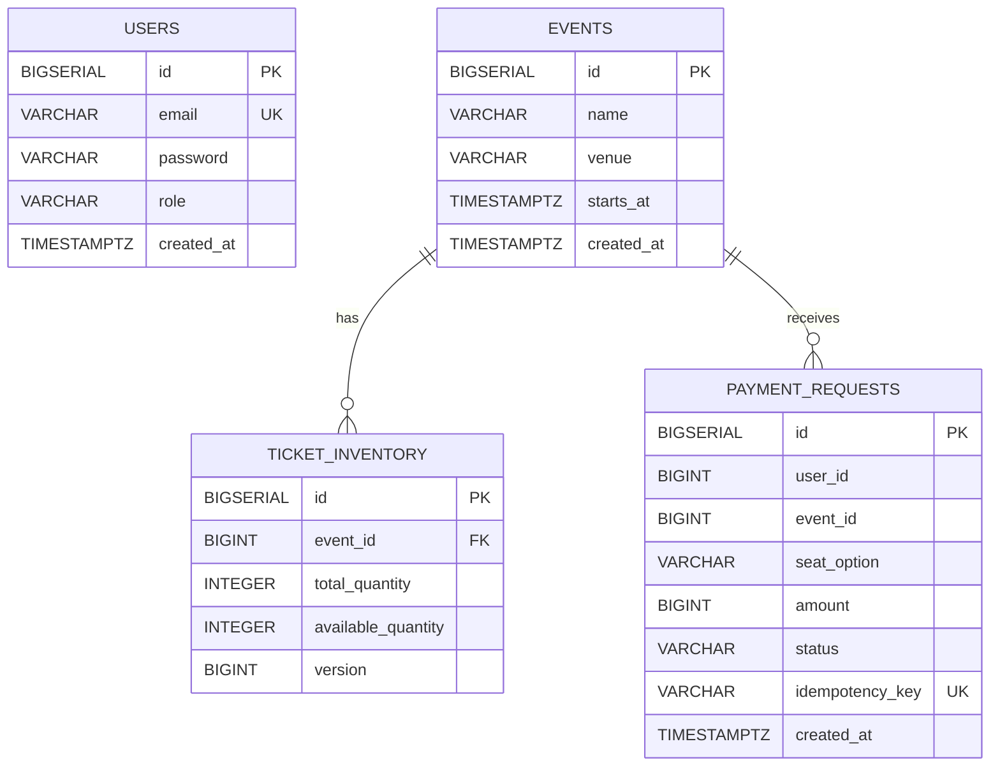

# ERD

근거:
- `src/main/resources/db/migration/V1__init_schema.sql`
- `src/main/java/com/example/ticketing/domain/entity/*.java`

## 테이블별 역할

- `users`: 계정/권한(USER, ADMIN) 저장.
- `events`: 예매 대상 이벤트 메타데이터.
- `ticket_inventory`: 이벤트별 재고 수량 관리. `version` 컬럼으로 낙관적 락 지원.
- `payment_requests`: 결제 요청 이력 및 중복 방지 키(idempotency) 저장.

## 운영 포인트

- 유니크 제약:
- `users.email` 유니크
- `payment_requests.idempotency_key` 유니크
- 인덱스:
- `idx_payment_requests_user_event_option` (`user_id`, `event_id`, `seat_option`)
- 락 전략:
- 조회 시 `findByEventIdForUpdate`에서 비관적 락 사용 (`PESSIMISTIC_WRITE`)
- 엔티티 `ticket_inventory.version`은 낙관적 락 필드로도 선언되어 있음
